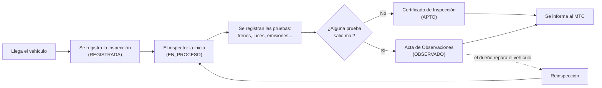

# 01 · El negocio: ¿qué problema resuelve RevTech?

> **Tiempo de lectura:** 10 minutos. **Antes:** nada. **Después:** [02 · Arquitectura](02-arquitectura.md).

Antes de abrir el código conviene entender **qué hace el sistema en el mundo real**. Todo el código de RevTech usa las
mismas palabras que se usan en un centro de inspección, así que si entiendes el negocio, entenderás los nombres de las clases.

---

## 1. La historia en un párrafo

En el Perú, los vehículos deben pasar periódicamente una **inspección técnica vehicular**: un centro autorizado revisa
que el vehículo sea seguro y no contamine. RevTech es el software de uno de esos centros. Registra cada inspección,
anota el resultado de cada prueba técnica, decide si el vehículo aprueba o no, emite el documento correspondiente e
informa el resultado al **MTC** (Ministerio de Transportes y Comunicaciones), que es la autoridad que regula el proceso.

## 2. El recorrido de un vehículo

1. **Registro.** Llega un vehículo. Se crea una inspección indicando qué vehículo es y qué inspector la hará
   (y, opcionalmente, un supervisor). El sistema verifica que el vehículo esté registrado y que el inspector exista y
   esté activo.
2. **Inicio.** El inspector comienza el trabajo; el sistema guarda la hora de inicio.
3. **Pruebas.** Se revisan los sistemas del vehículo: **frenos, dirección, suspensión, luces, neumáticos y emisiones**.
   Cada prueba recibe un veredicto: `APROBADO`, `OBSERVADO` o `RECHAZADO`. Cada tipo de prueba se registra una sola vez.
4. **Finalización.** El sistema mira todas las pruebas:
   - Si **todas** están aprobadas, el vehículo es **APTO** y se emite un **Certificado de Inspección**.
   - Si **al menos una** salió observada o rechazada, el vehículo queda **OBSERVADO** y se emite un **Acta de Observaciones**
     con las deficiencias.
   - Nunca se emiten los dos documentos, y no se puede finalizar sin pruebas.
5. **Reporte al MTC.** Al terminar, el resultado se informa al MTC.
6. **Reinspección.** Si el vehículo quedó OBSERVADO, su dueño lo repara y vuelve. Se registra una **reinspección**, que
   solo se permite sobre una inspección **finalizada con resultado OBSERVADO** y siempre **para el mismo vehículo**.

## 3. Quiénes participan

| Actor | Qué hace en RevTech |
|---|---|
| Recepcionista | Registra clientes, vehículos e inspecciones |
| Inspector técnico | Ejecuta las pruebas y finaliza la inspección |
| Supervisor | Puede quedar asignado a una inspección para revisarla |
| Administrador | Gestiona usuarios y roles |
| MTC | Sistema externo del Estado que recibe el resultado de cada inspección |

## 4. Las áreas del negocio (contextos acotados)

Un sistema grande se entiende mejor si se divide en **áreas con responsabilidades separadas**. En *Domain-Driven Design*
(DDD) cada área se llama **contexto acotado** (*bounded context*): tiene su propio modelo y sus propias palabras, y no se
mete en los datos de otra área.

| Contexto | Responsabilidad | Estado |
|---|---|---|
| **Inspección** (núcleo) | Ciclo de vida de la inspección, pruebas, certificado o acta | ✅ Implementado |
| **Atención a Clientes** | Clientes y sus vehículos | ✅ Implementado |
| **Identidad y Acceso** | Usuarios del personal y sus roles | ✅ Implementado |
| Citas | Agenda y turnos de inspección | ⏳ Pendiente |
| Pagos | Cobros y comprobantes | ⏳ Pendiente |
| Administrativa | Personal, proveedores, mantenimiento, reportes | ⏳ Pendiente |
| MTC | Sistema externo; RevTech solo se comunica con él | 🔌 Integración |

Inspección es el **núcleo** (*core domain*): es lo que hace valioso a RevTech. Los demás contextos lo apoyan.

> La definición formal de cada contexto, entidad y objeto de valor está en el documento académico
> [DISEÑO TÁCTICO - REVTECH](DISEÑO%20TÁCTICO%20-%20REVTECH.md).

## 5. Glosario: de la palabra del negocio a la clase

Esta tabla es tu diccionario. Si en una reunión se habla de un concepto, aquí ves dónde vive en el código
(rutas relativas a `revtech-app/src/main/java/org/parangaricutirimicuaro/revtech/`).

| Término del negocio | Qué significa | Dónde está en el código |
|---|---|---|
| Inspección técnica | El proceso completo de revisar un vehículo | [`InspeccionTecnica`](../revtech-app/src/main/java/org/parangaricutirimicuaro/revtech/domain/inspeccion/model/InspeccionTecnica.java) |
| Reinspección | Nueva inspección de un vehículo que quedó observado | `InspeccionTecnica.reinspeccionar(...)` y [`TipoInspeccion`](../revtech-app/src/main/java/org/parangaricutirimicuaro/revtech/domain/inspeccion/model/TipoInspeccion.java) |
| Estado del proceso | REGISTRADA → EN_PROCESO → FINALIZADA | [`EstadoProceso`](../revtech-app/src/main/java/org/parangaricutirimicuaro/revtech/domain/inspeccion/model/EstadoProceso.java) |
| Prueba técnica | Frenos, dirección, suspensión, luces, neumáticos, emisiones | [`TipoPrueba`](../revtech-app/src/main/java/org/parangaricutirimicuaro/revtech/domain/inspeccion/model/TipoPrueba.java) |
| Veredicto | Aprobado, observado o rechazado | [`VeredictoPrueba`](../revtech-app/src/main/java/org/parangaricutirimicuaro/revtech/domain/inspeccion/model/VeredictoPrueba.java) |
| Resultado de una prueba | Una prueba con su veredicto | [`ResultadoPrueba`](../revtech-app/src/main/java/org/parangaricutirimicuaro/revtech/domain/inspeccion/model/ResultadoPrueba.java) |
| Apto / Observado | Condición final del vehículo | [`ResultadoInspeccion`](../revtech-app/src/main/java/org/parangaricutirimicuaro/revtech/domain/inspeccion/model/ResultadoInspeccion.java), [`CondicionInspeccion`](../revtech-app/src/main/java/org/parangaricutirimicuaro/revtech/domain/inspeccion/model/CondicionInspeccion.java) |
| Periodo de inspección | Hora de inicio y fin | [`PeriodoInspeccion`](../revtech-app/src/main/java/org/parangaricutirimicuaro/revtech/domain/inspeccion/model/PeriodoInspeccion.java) |
| Certificado de Inspección | Documento para un vehículo APTO | [`CertificadoInspeccion`](../revtech-app/src/main/java/org/parangaricutirimicuaro/revtech/domain/inspeccion/model/CertificadoInspeccion.java) |
| Acta de Observaciones | Documento con las deficiencias de un vehículo OBSERVADO | [`ActaObservaciones`](../revtech-app/src/main/java/org/parangaricutirimicuaro/revtech/domain/inspeccion/model/ActaObservaciones.java) |
| Inspección finalizada | Aviso de que una inspección terminó (se usa para informar al MTC) | [`InspeccionFinalizada`](../revtech-app/src/main/java/org/parangaricutirimicuaro/revtech/domain/inspeccion/event/InspeccionFinalizada.java) |
| Cliente | Propietario o conductor | [`Cliente`](../revtech-app/src/main/java/org/parangaricutirimicuaro/revtech/domain/clientes/model/Cliente.java) |
| Vehículo | Vehículo registrado a nombre de un cliente | [`Vehiculo`](../revtech-app/src/main/java/org/parangaricutirimicuaro/revtech/domain/clientes/model/Vehiculo.java) |
| Categoría vehicular | L, M1, N3, etc. | [`CategoriaVehiculo`](../revtech-app/src/main/java/org/parangaricutirimicuaro/revtech/domain/clientes/model/CategoriaVehiculo.java) |
| Usuario | Cuenta de un miembro del personal | [`Usuario`](../revtech-app/src/main/java/org/parangaricutirimicuaro/revtech/domain/identidad/model/Usuario.java) |
| Rol de acceso | Inspector, supervisor, administrador... con sus permisos | [`RolAcceso`](../revtech-app/src/main/java/org/parangaricutirimicuaro/revtech/domain/identidad/model/RolAcceso.java), [`NombreRol`](../revtech-app/src/main/java/org/parangaricutirimicuaro/revtech/domain/identidad/model/NombreRol.java) |
| Personal | Inspector o supervisor visto desde Inspección (solo su identificador) | [`PersonalId`](../revtech-app/src/main/java/org/parangaricutirimicuaro/revtech/domain/inspeccion/model/PersonalId.java) |

> Observa que Inspección no tiene una clase `Vehiculo` ni `Usuario`: solo guarda sus **identificadores**
> (`VehiculoId`, `PersonalId`). Los datos completos pertenecen a otros contextos. En la guía de arquitectura verás por qué.

---

**Siguiente:** [02 · Arquitectura](02-arquitectura.md) — cómo está organizado el código.

<!-- canary -->
