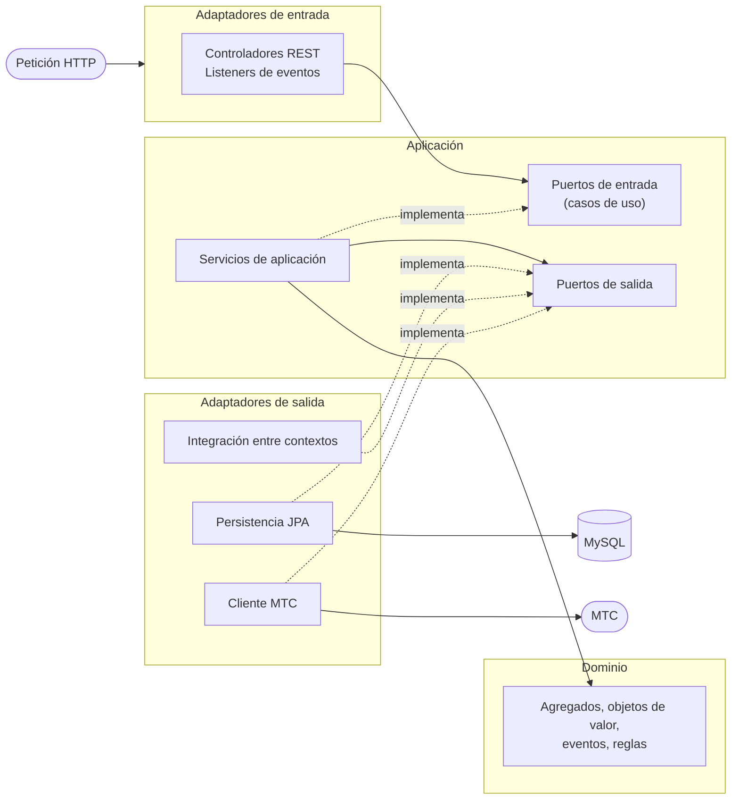

# 02 · Arquitectura: cómo está organizado el código

> **Tiempo de lectura:** 15 minutos. **Antes:** [01 · El negocio](01-el-negocio.md). **Después:** [03 · Recorrido de una petición](03-recorrido-de-una-peticion.md).

RevTech es un **monolito modular con arquitectura hexagonal**. Esta guía explica qué significa cada palabra, por qué se
eligió y cómo se refleja en las carpetas del proyecto.

---

## 1. La idea en una analogía

Piensa en un **enchufe universal**. El aparato (tu laptop) funciona igual en cualquier país; lo único que cambia es el
**adaptador** que conectas a la pared. El aparato define la forma del conector (**puerto**) y cada país pone un adaptador distinto.

La arquitectura hexagonal hace lo mismo con el software:

- En el centro está la **lógica del negocio** (las reglas de la inspección). No sabe nada de HTTP, MySQL ni Spring.
- La lógica declara **puertos**: interfaces Java que dicen *"necesito guardar una inspección"* o *"necesito saber si
  este vehículo existe"*.
- Afuera hay **adaptadores**: clases que implementan esos puertos con una tecnología concreta (JPA para MySQL, un
  controlador REST, un cliente HTTP para el MTC).

Si mañana cambiamos MySQL por otra base de datos, solo cambia un adaptador. Las reglas del negocio no se tocan.

## 2. Las tres capas



| Capa | Qué contiene | Qué puede usar |
|---|---|---|
| **Dominio** | Las reglas del negocio: agregados, objetos de valor, eventos, excepciones | Nada. Es Java puro: sin Spring, JPA ni Lombok |
| **Aplicación** | Los casos de uso (*"crear inspección"*), sus puertos y los servicios que los implementan | Solo el dominio |
| **Adaptadores** | Todo lo que toca tecnología: REST, JPA, HTTP, eventos de Spring | Aplicación y dominio |
| **Configuración** | Clases `@Configuration` que conectan todo | Todo |

**La regla de oro:** las dependencias siempre apuntan **hacia el centro**. Un adaptador puede usar el dominio; el
dominio nunca puede usar un adaptador. Por eso los servicios de aplicación no tienen `@Service`: son clases normales
que se registran como beans en `config/`.

### Vocabulario mínimo de DDD

| Término | Significado | Ejemplo en RevTech |
|---|---|---|
| **Entidad** | Objeto con identidad propia que cambia en el tiempo | `Vehiculo`, `Usuario` |
| **Objeto de valor** | Objeto definido solo por sus datos; inmutable (aquí, `record`) | `PeriodoInspeccion`, `ResultadoPrueba` |
| **Agregado** | Grupo de objetos que se guarda y modifica como una unidad. Su **raíz** es la única puerta de entrada | `InspeccionTecnica` (raíz) con su certificado o acta |
| **Evento de dominio** | Hecho del negocio que ya ocurrió | `InspeccionFinalizada` |
| **Identificador tipado** | `record` que envuelve un `Long` para no confundir IDs | `VehiculoId`, `PersonalId` |
| **Caso de uso** | Una acción que el sistema ofrece | `CrearInspeccionUseCase` |

## 3. ¿Por qué un monolito modular y no microservicios?

RevTech empezó como cuatro microservicios (inspección, clientes, identidad y un *gateway*). Se unieron en una sola
aplicación porque, para un equipo pequeño, los microservicios solo añadían costo: cuatro procesos que levantar, tres
bases de datos, llamadas HTTP entre servicios que podían fallar y simulaciones (*mocks*) para poder probar.

Un **monolito modular** se despliega como **una sola aplicación**, pero mantiene los contextos separados por dentro.
Si algún día un contexto necesita ser un servicio independiente, basta con reemplazar un adaptador.

## 4. Las carpetas: capa primero, contexto después

Todo el código está en `revtech-app/src/main/java/org/parangaricutirimicuaro/revtech/`. El primer nivel es la **capa** y
dentro de cada capa hay una carpeta por **contexto**:

```
revtech/
 ├─ RevTechApplication.java        ← punto de arranque
 ├─ domain/
 │   ├─ inspeccion/   model · event · exception
 │   ├─ clientes/     model · exception
 │   └─ identidad/    model · exception
 ├─ application/
 │   ├─ inspeccion/   port/in · port/out · service · exception
 │   ├─ clientes/     port/in · port/out · service
 │   └─ identidad/    port/in · port/out · service
 ├─ adapter/
 │   ├─ in/web/           inspeccion · clientes · identidad · shared
 │   ├─ in/event/         inspeccion
 │   ├─ out/persistence/  inspeccion · clientes · identidad
 │   ├─ out/event/        inspeccion
 │   ├─ out/integration/  inspeccion
 │   └─ out/client/       (MTC)
 └─ config/       inspeccion · clientes · identidad · (Scalar, CORS, Feign)
```

### ¿Dónde va mi código?

| Si vas a escribir… | Va en… | Ejemplo existente |
|---|---|---|
| Una regla del negocio | `domain/<contexto>/model` | [`InspeccionTecnica.finalizar`](../revtech-app/src/main/java/org/parangaricutirimicuaro/revtech/domain/inspeccion/model/InspeccionTecnica.java) |
| Un error del negocio | `domain/<contexto>/exception` | [`ReglaNegocioVioladaException`](../revtech-app/src/main/java/org/parangaricutirimicuaro/revtech/domain/inspeccion/exception/ReglaNegocioVioladaException.java) |
| Una nueva acción del sistema | Interfaz en `application/<contexto>/port/in` + implementación en `application/<contexto>/service` | [`CrearVehiculoUseCase`](../revtech-app/src/main/java/org/parangaricutirimicuaro/revtech/application/clientes/port/in/CrearVehiculoUseCase.java), [`VehiculoApplicationService`](../revtech-app/src/main/java/org/parangaricutirimicuaro/revtech/application/clientes/service/VehiculoApplicationService.java) |
| Algo que la aplicación necesita del exterior | Interfaz en `application/<contexto>/port/out` | [`VehiculoPort`](../revtech-app/src/main/java/org/parangaricutirimicuaro/revtech/application/inspeccion/port/out/VehiculoPort.java) |
| Un endpoint REST | `adapter/in/web/<contexto>` | [`VehiculoController`](../revtech-app/src/main/java/org/parangaricutirimicuaro/revtech/adapter/in/web/clientes/VehiculoController.java) |
| Una tabla o consulta | `adapter/out/persistence/<contexto>` | [`VehiculoPersistenceAdapter`](../revtech-app/src/main/java/org/parangaricutirimicuaro/revtech/adapter/out/persistence/clientes/VehiculoPersistenceAdapter.java) |
| Una consulta a **otro contexto** | `adapter/out/integration/<tu contexto>` | [`VehiculoIntegrationAdapter`](../revtech-app/src/main/java/org/parangaricutirimicuaro/revtech/adapter/out/integration/inspeccion/VehiculoIntegrationAdapter.java) |
| Una llamada a un sistema externo | `adapter/out/client` | [`MtcClientAdapter`](../revtech-app/src/main/java/org/parangaricutirimicuaro/revtech/adapter/out/client/MtcClientAdapter.java) |
| El registro de un servicio como bean | `config/<contexto>` | [`ClientesConfig`](../revtech-app/src/main/java/org/parangaricutirimicuaro/revtech/config/clientes/ClientesConfig.java) |
| La traducción de un error a HTTP | `adapter/in/web/shared` | [`GlobalExceptionHandler`](../revtech-app/src/main/java/org/parangaricutirimicuaro/revtech/adapter/in/web/shared/GlobalExceptionHandler.java) |

## 5. Cómo se comunican los contextos

Un contexto **nunca** importa clases del dominio o de la aplicación de otro contexto. Así, cambiar Clientes no rompe Inspección.

Cuando Inspección necesita saber si un vehículo existe, sigue tres pasos:

1. Inspección declara **su propio** puerto de salida, [`VehiculoPort`](../revtech-app/src/main/java/org/parangaricutirimicuaro/revtech/application/inspeccion/port/out/VehiculoPort.java),
   con la mínima información que necesita (`VehiculoInfo`: identificador y placa).
2. Clientes ofrece un puerto de entrada, [`ConsultarVehiculoUseCase`](../revtech-app/src/main/java/org/parangaricutirimicuaro/revtech/application/clientes/port/in/ConsultarVehiculoUseCase.java).
3. Un adaptador de integración, [`VehiculoIntegrationAdapter`](../revtech-app/src/main/java/org/parangaricutirimicuaro/revtech/adapter/out/integration/inspeccion/VehiculoIntegrationAdapter.java),
   implementa el primero llamando al segundo y traduce el resultado.

Con usuarios ocurre lo mismo mediante [`UsuarioPort`](../revtech-app/src/main/java/org/parangaricutirimicuaro/revtech/application/inspeccion/port/out/UsuarioPort.java)
y [`UsuarioIntegrationAdapter`](../revtech-app/src/main/java/org/parangaricutirimicuaro/revtech/adapter/out/integration/inspeccion/UsuarioIntegrationAdapter.java).
Es una llamada a un método en la misma aplicación: no hay red de por medio.

## 6. Las reglas se comprueban solas

[`HexagonalArchitectureTest`](../revtech-app/src/test/java/org/parangaricutirimicuaro/revtech/architecture/HexagonalArchitectureTest.java)
usa **ArchUnit**, una librería que analiza las dependencias entre clases durante las pruebas. Falla el build si:

- una capa interna depende de una externa, o el dominio o la aplicación usan Spring o JPA;
- un adaptador de entrada usa un adaptador de salida;
- un contexto importa el `domain` o la `application` de otro contexto;
- un adaptador de integración llama a un servicio de otro contexto en lugar de a su puerto de entrada.

Así nadie rompe la arquitectura por accidente. Al crear un contexto nuevo, se agrega su nombre a la lista `CONTEXTOS` de esa prueba.

## 7. Reglas del negocio de Inspección

Todas viven en el agregado [`InspeccionTecnica`](../revtech-app/src/main/java/org/parangaricutirimicuaro/revtech/domain/inspeccion/model/InspeccionTecnica.java):

- **Ciclo de vida:** `REGISTRADA → EN_PROCESO → FINALIZADA`. Cualquier otro salto lanza `TransicionEstadoInvalidaException`.
- Las pruebas solo se registran con la inspección `EN_PROCESO`, y cada tipo de prueba una sola vez.
- No se puede finalizar sin pruebas. Al finalizar se emite **exactamente un** documento: certificado si todas las
  pruebas están `APROBADO`, acta si alguna está `OBSERVADO` o `RECHAZADO`.
- Una reinspección solo procede sobre una inspección `FINALIZADA` con resultado `OBSERVADO`, y para el mismo vehículo.
- El agregado no tiene *setters*: solo cambia con `iniciar`, `registrarPrueba` y `finalizar`. Su `Snapshot` impide
  reconstruir desde la base de datos una inspección con datos incoherentes.

Clientes e Identidad tienen reglas más simples: documento, nombre y placa obligatorios (la placa se guarda en
mayúsculas), *username* único y roles existentes y activos.

## 8. Eventos de dominio: informar al MTC

Cuando una inspección termina, el agregado **registra** el evento `InspeccionFinalizada`. El servicio de aplicación
primero guarda la inspección y **después** publica el evento. Un *listener* lo recibe y llama al caso de uso que
informa al MTC. Si el MTC falla, solo se registra una advertencia en el log: la inspección ya quedó guardada.
El detalle paso a paso está en la [guía 03](03-recorrido-de-una-peticion.md#2-finalizar-una-inspección).

## 9. Errores HTTP

El [`GlobalExceptionHandler`](../revtech-app/src/main/java/org/parangaricutirimicuaro/revtech/adapter/in/web/shared/GlobalExceptionHandler.java)
convierte cada excepción del dominio en una respuesta con formato estándar *Problem Details* (RFC 9457):

| Situación | Excepción | HTTP |
|---|---|---|
| Dato mal formado | `DatoInvalidoException`, `DatoClienteInvalidoException`, `DatoIdentidadInvalidoException`, validación del request | 400 |
| No existe | `InspeccionNoEncontradaException`, `RecursoIdentidadNoEncontradoException` | 404 |
| Regla de negocio violada | `TransicionEstadoInvalidaException`, `ReglaNegocioVioladaException`, `ReglaIdentidadVioladaException` | 409 |
| Vehículo o personal inexistente o inactivo | `ReferenciaExternaInvalidaException` | 422 |
| Servicio externo caído (hoy ningún adaptador la lanza; queda para futuras integraciones) | `ServicioExternoNoDisponibleException` | 503 |

Las consultas `GET` de clientes, vehículos y usuarios responden 404 sin cuerpo cuando el recurso no existe.

## 10. Base de datos

- Un solo esquema MySQL, `revtech`. Cada contexto es dueño de sus tablas y **solo su adaptador de persistencia las toca**:
  - Inspección: `inspecciones_tecnicas`, `inspeccion_pruebas`, `certificados_inspeccion`, `actas_observaciones`.
  - Clientes: `clientes`, `vehiculos`.
  - Identidad: `usuarios`, `roles_acceso`, `rol_permisos`.
- Las tablas las crea Hibernate al arrancar (`ddl-auto=update`); todavía no hay migraciones versionadas.
- Las clases JPA (`*JpaEntity`) son distintas de las del dominio. Un *mapper* traduce entre ambas, para que el dominio
  no dependa de JPA. Ejemplo: [`InspeccionPersistenceMapper`](../revtech-app/src/main/java/org/parangaricutirimicuaro/revtech/adapter/out/persistence/inspeccion/InspeccionPersistenceMapper.java).
- Clientes y roles se cargan directamente en la base de datos: todavía no hay endpoints para crearlos.

## 11. Pruebas

| Suite | Qué comprueba | ¿Necesita MySQL? |
|---|---|---|
| `domain.*` | Reglas de los agregados y objetos de valor | No |
| `application.*.service.*` | Casos de uso con puertos simulados (Mockito o implementaciones en memoria) | No |
| `adapter.in.web.*` | Contrato JSON, validación y códigos HTTP (`@WebMvcTest`) | No |
| `adapter.out.integration.*`, `adapter.out.client.*`, `*MapperTest` | Traducciones de los adaptadores | No |
| `adapter.*.event.*` | Publicación y recepción de eventos en Spring | No |
| `architecture.HexagonalArchitectureTest` | Las reglas de arquitectura | No |
| `InspeccionPersistenceAdapterTest`, `RevTechApplicationTests` | JPA contra MySQL real y arranque completo | Sí |

```powershell
# Solo las pruebas que no necesitan base de datos
./mvnw test -pl revtech-app "-Dtest=!InspeccionPersistenceAdapterTest,!RevTechApplicationTests" "-Dsurefire.failIfNoSpecifiedTests=false"

# Todas
mise run db:up
./mvnw test -pl revtech-app
```

---

**Siguiente:** [03 · Recorrido de una petición](03-recorrido-de-una-peticion.md) — sigue una petición real archivo por archivo.
