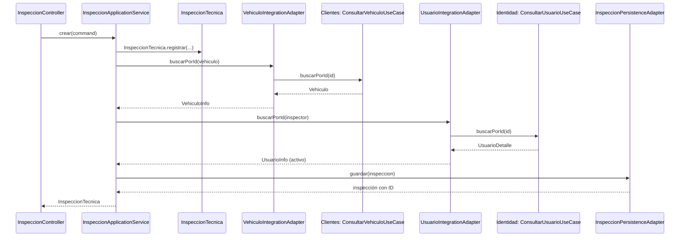
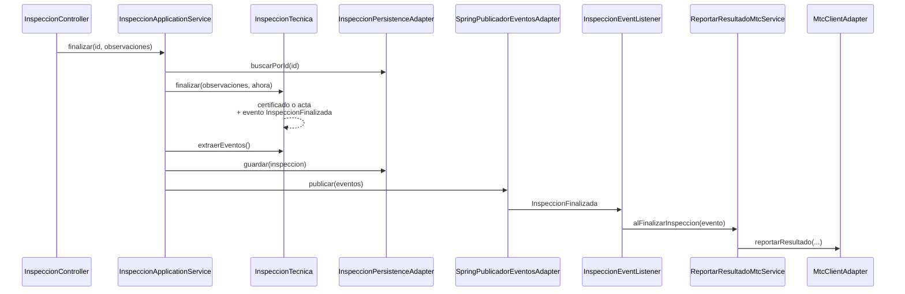

# 03 · Recorrido de una petición, archivo por archivo

> **Tiempo de lectura:** 15 minutos. **Antes:** [02 · Arquitectura](02-arquitectura.md). **Después:** [04 · Cómo agregar un contexto](04-como-agregar-un-contexto.md).

La mejor forma de entender una arquitectura es **seguir una petición** desde que entra hasta que sale. Abre cada
archivo enlazado a medida que avanzas. Para acortar, `…/` significa
`revtech-app/src/main/java/org/parangaricutirimicuaro/revtech/`.

---

## 1. Crear una inspección

```http
POST /api/inspecciones
{ "idVehiculo": 1, "idInspector": 1, "tipoInspeccion": "INSPECCION" }
```



### Paso 1 — El adaptador de entrada recibe el HTTP
[`…/adapter/in/web/inspeccion/InspeccionController.java`](../revtech-app/src/main/java/org/parangaricutirimicuaro/revtech/adapter/in/web/inspeccion/InspeccionController.java), método `crear`.

- Spring convierte el JSON en un [`CrearInspeccionRequestDto`](../revtech-app/src/main/java/org/parangaricutirimicuaro/revtech/adapter/in/web/inspeccion/dto/CrearInspeccionRequestDto.java) y `@Valid` revisa los campos obligatorios.
- El controlador **no tiene lógica**: arma un `CrearInspeccionCommand` y llama al caso de uso.
- Fíjate en el tipo del campo: `CrearInspeccionUseCase`, una **interfaz**. El controlador no sabe qué clase la implementa.

### Paso 2 — El puerto de entrada
[`…/application/inspeccion/port/in/CrearInspeccionUseCase.java`](../revtech-app/src/main/java/org/parangaricutirimicuaro/revtech/application/inspeccion/port/in/CrearInspeccionUseCase.java)

Es solo un contrato: *"dame un comando y te devuelvo una inspección"*. El `record` del comando vive dentro de la misma interfaz.

### Paso 3 — El servicio de aplicación orquesta
[`…/application/inspeccion/service/InspeccionApplicationService.java`](../revtech-app/src/main/java/org/parangaricutirimicuaro/revtech/application/inspeccion/service/InspeccionApplicationService.java), método `crear`.

1. Convierte los `Long` en identificadores tipados (`VehiculoId.of`, `PersonalId.of`).
2. Según el tipo, pide al **agregado** que se cree: `InspeccionTecnica.registrar(...)` o `InspeccionTecnica.reinspeccionar(...)`.
3. Verifica las referencias externas a través de **puertos de salida**: `vehiculoPort.buscarPorId(...)` y `validarPersonalActivo(...)`.
   Si algo no existe, lanza `ReferenciaExternaInvalidaException` (HTTP 422).
4. Guarda con `repository.guardar(inspeccion)`.

El servicio **coordina, pero no decide**: las reglas están en el agregado.

> **¿Quién crea este servicio?** No tiene `@Service`. Lo registra como bean
> [`…/config/inspeccion/InspeccionConfig.java`](../revtech-app/src/main/java/org/parangaricutirimicuaro/revtech/config/inspeccion/InspeccionConfig.java),
> que le pasa los adaptadores que implementan cada puerto. Esa clase es el único lugar donde todo se conecta.

### Paso 4 — El agregado aplica las reglas
[`…/domain/inspeccion/model/InspeccionTecnica.java`](../revtech-app/src/main/java/org/parangaricutirimicuaro/revtech/domain/inspeccion/model/InspeccionTecnica.java)

- `registrar` crea la inspección en estado `REGISTRADA`.
- `reinspeccionar` comprueba que el origen esté `FINALIZADA` con resultado `OBSERVADO` y que sea el mismo vehículo.
  **Esta es la respuesta a "¿dónde está la regla de la reinspección?".**

### Paso 5 — Cruzar a otro contexto sin acoplarse
[`…/adapter/out/integration/inspeccion/VehiculoIntegrationAdapter.java`](../revtech-app/src/main/java/org/parangaricutirimicuaro/revtech/adapter/out/integration/inspeccion/VehiculoIntegrationAdapter.java)

Implementa `VehiculoPort` (de Inspección) llamando a `ConsultarVehiculoUseCase` (de Clientes). A partir de aquí el
flujo entra en Clientes: [`VehiculoApplicationService`](../revtech-app/src/main/java/org/parangaricutirimicuaro/revtech/application/clientes/service/VehiculoApplicationService.java)
→ [`VehiculoPersistenceAdapter`](../revtech-app/src/main/java/org/parangaricutirimicuaro/revtech/adapter/out/persistence/clientes/VehiculoPersistenceAdapter.java)
→ tabla `vehiculos`. Al volver, el adaptador traduce el `Vehiculo` de Clientes al `VehiculoInfo` que entiende Inspección.

[`UsuarioIntegrationAdapter`](../revtech-app/src/main/java/org/parangaricutirimicuaro/revtech/adapter/out/integration/inspeccion/UsuarioIntegrationAdapter.java)
hace lo mismo con Identidad para el inspector y el supervisor.

**Esta es la respuesta a "¿cómo sabe Inspección que un vehículo existe?".**

### Paso 6 — Guardar en MySQL
[`…/adapter/out/persistence/inspeccion/InspeccionPersistenceAdapter.java`](../revtech-app/src/main/java/org/parangaricutirimicuaro/revtech/adapter/out/persistence/inspeccion/InspeccionPersistenceAdapter.java)

1. [`InspeccionPersistenceMapper`](../revtech-app/src/main/java/org/parangaricutirimicuaro/revtech/adapter/out/persistence/inspeccion/InspeccionPersistenceMapper.java)
   convierte el agregado en [`InspeccionTecnicaJpaEntity`](../revtech-app/src/main/java/org/parangaricutirimicuaro/revtech/adapter/out/persistence/inspeccion/entity/InspeccionTecnicaJpaEntity.java)
   usando el `Snapshot` del agregado.
2. El repositorio de Spring Data la guarda en la tabla `inspecciones_tecnicas`.
3. El mapper convierte la fila guardada de vuelta en un agregado, ya con su ID.

`@Transactional` está aquí, en el adaptador, porque las transacciones son un detalle técnico.

### Paso 7 — De vuelta al cliente HTTP
El controlador convierte el agregado en [`InspeccionResponseDto`](../revtech-app/src/main/java/org/parangaricutirimicuaro/revtech/adapter/in/web/inspeccion/dto/InspeccionResponseDto.java)
con [`InspeccionWebMapper`](../revtech-app/src/main/java/org/parangaricutirimicuaro/revtech/adapter/in/web/inspeccion/InspeccionWebMapper.java) y responde `201 Created`.

Si en cualquier paso se lanzó una excepción del dominio,
[`GlobalExceptionHandler`](../revtech-app/src/main/java/org/parangaricutirimicuaro/revtech/adapter/in/web/shared/GlobalExceptionHandler.java)
la convierte en el código HTTP adecuado.

---

## 2. Finalizar una inspección

```http
PUT /api/inspecciones/1/finalizar
{ "observaciones": "Vehículo en buen estado" }
```



### Paso 1 — El agregado decide
`InspeccionTecnica.finalizar` en [`…/domain/inspeccion/model/InspeccionTecnica.java`](../revtech-app/src/main/java/org/parangaricutirimicuaro/revtech/domain/inspeccion/model/InspeccionTecnica.java):

- Exige estado `EN_PROCESO` y al menos una prueba.
- Si alguna prueba es deficiente (`ResultadoPrueba::esDeficiente`), emite un `ActaObservaciones` y el resultado es `OBSERVADO`;
  si no, emite un `CertificadoInspeccion` y el resultado es `APTO`.
- Cierra el periodo y **registra** el evento `InspeccionFinalizada` en una lista interna.

**Esta es la respuesta a "¿qué archivo decide si se emite certificado o acta?".** El método `emitir` de
`CertificadoInspeccion` y de `ActaObservaciones` es visible solo dentro de su paquete: nada fuera del modelo de
Inspección puede emitir un documento.

### Paso 2 — Guardar primero, avisar después
En `InspeccionApplicationService.finalizar`, el orden importa:

1. `inspeccion.extraerEventos()` saca los eventos pendientes del agregado.
2. `repository.guardar(inspeccion)` persiste.
3. `publicador.publicar(eventos)` avisa al resto del sistema.

Si guardar falla, no se publica nada: nunca se informa al MTC una inspección que no quedó registrada.

### Paso 3 — El evento viaja dentro de la aplicación
- [`SpringPublicadorEventosAdapter`](../revtech-app/src/main/java/org/parangaricutirimicuaro/revtech/adapter/out/event/inspeccion/SpringPublicadorEventosAdapter.java)
  implementa el puerto `PublicadorEventosPort` con el `ApplicationEventPublisher` de Spring.
- [`InspeccionEventListener`](../revtech-app/src/main/java/org/parangaricutirimicuaro/revtech/adapter/in/event/inspeccion/InspeccionEventListener.java)
  es un **adaptador de entrada**: recibe el evento con `@EventListener` y llama al caso de uso `ReportarResultadoMtcUseCase`.

### Paso 4 — Informar al MTC
[`ReportarResultadoMtcService`](../revtech-app/src/main/java/org/parangaricutirimicuaro/revtech/application/inspeccion/service/ReportarResultadoMtcService.java)
obtiene la placa (otra vez por `VehiculoPort`) y llama a `MtcPort`.
[`MtcClientAdapter`](../revtech-app/src/main/java/org/parangaricutirimicuaro/revtech/adapter/out/client/MtcClientAdapter.java)
usa el cliente activo:

- [`MockMtcClient`](../revtech-app/src/main/java/org/parangaricutirimicuaro/revtech/adapter/out/client/mock/MockMtcClient.java) por defecto (`revtech.clients.mock=true`): escribe en el log.
- [`FeignMtcClient`](../revtech-app/src/main/java/org/parangaricutirimicuaro/revtech/adapter/out/client/feign/FeignMtcClient.java) con `revtech.clients.mock=false`: llamada HTTP real.

Un fallo aquí solo deja una advertencia en el log: el reporte es de **mejor esfuerzo**.

---

## 3. Ejercicios para comprobar que entendiste

1. ¿En qué clase agregarías una regla como *"no se puede registrar la prueba de emisiones antes que la de frenos"*?
2. Si quisieras guardar las inspecciones en otra base de datos, ¿qué clases cambiarías y cuáles no?
3. ¿Por qué `InspeccionApplicationService` puede probarse sin levantar Spring ni MySQL?
   (Pista: mira [`InspeccionApplicationServiceTest`](../revtech-app/src/test/java/org/parangaricutirimicuaro/revtech/application/inspeccion/service/InspeccionApplicationServiceTest.java).)
4. ¿Qué pasaría si `VehiculoIntegrationAdapter` llamara directamente a `VehiculoPersistenceAdapter`? ¿Qué prueba fallaría?

<details>
<summary>Respuestas</summary>

1. En `InspeccionTecnica.registrarPrueba`: es una regla del negocio, así que va en el agregado.
2. Cambian `InspeccionPersistenceAdapter`, su mapper, sus entidades JPA y su repositorio. No cambian el dominio, la aplicación ni el controlador.
3. Porque solo depende de interfaces (puertos). En la prueba se reemplazan por simulaciones de Mockito y un reloj fijo.
4. Inspección dependería de la base de datos de Clientes y se saltaría sus casos de uso. Fallaría `HexagonalArchitectureTest`,
   porque la regla de capas prohíbe que un adaptador dependa de otro adaptador.

</details>

---

**Siguiente:** [04 · Cómo agregar un contexto](04-como-agregar-un-contexto.md) — construye tu propio contexto siguiendo el mismo patrón.
