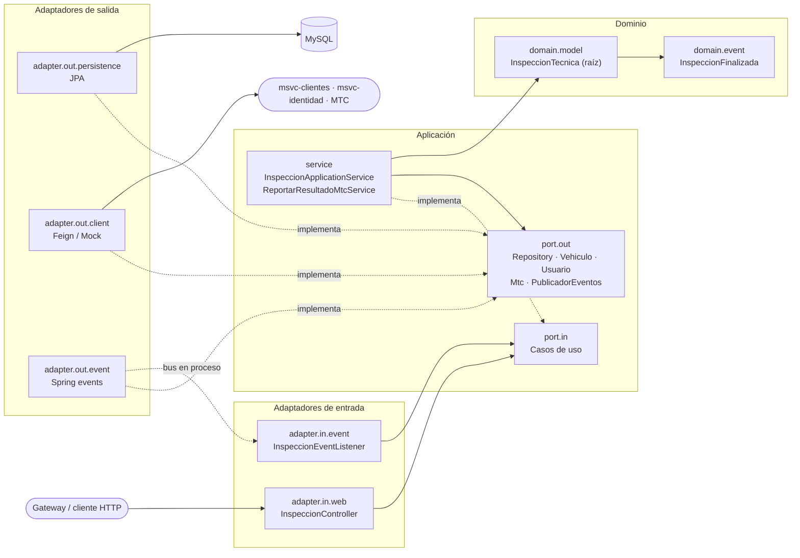
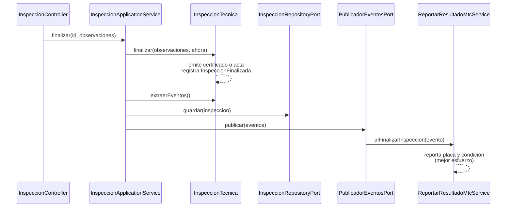

# Arquitectura Hexagonal — `msvc-inspection`

`msvc-inspection` implementa el **Agregado de Inspección (Core)** definido en
[DISEÑO TÁCTICO - REVTECH](DISEÑO%20TÁCTICO%20-%20REVTECH.md) siguiendo el patrón arquitectonico *Ports & Adapters*.

## Capas y regla de dependencias



Las flechas apuntan siempre hacia el centro. Los adaptadores implementan los puertos que define la aplicación, y el dominio no depende de nada.

| Capa | Paquete | Depende de |
|---|---|---|
| Dominio | `domain.model`, `domain.event`, `domain.exception` | Nada (Java puro) |
| Aplicación | `application.port.in`, `application.port.out`, `application.service`, `application.exception` | Dominio |
| Adaptadores de entrada | `adapter.in.web`, `adapter.in.event` | Puertos de entrada, dominio |
| Adaptadores de salida | `adapter.out.persistence`, `adapter.out.client`, `adapter.out.event` | Puertos de salida, dominio |
| Composición | `config` | Todo (ensambla los beans) |

La regla se verifica automáticamente con ArchUnit (`architecture/HexagonalArchitectureTest`).

## Modelo de dominio

| Patrón DDD | Implementación |
|---|---|
| Raíz de agregado | `InspeccionTecnica`: sin setters; el estado solo cambia mediante `iniciar`, `registrarPrueba` y `finalizar`. |
| Entidades internas | `CertificadoInspeccion`, `ActaObservaciones`: solo la raíz puede emitirlas (factorías de paquete). |
| Objetos de valor | `PeriodoInspeccion`, `ResultadoInspeccion`, `ResultadoPrueba` (records inmutables, validados al construirse). |
| Catálogos del lenguaje ubicuo | `TipoPrueba` (frenos, dirección, suspensión, luces, neumáticos, emisiones), `VeredictoPrueba`, `TipoInspeccion`, `EstadoProceso`. |
| Identificadores tipados | `InspeccionId`, `VehiculoId`, `PersonalId`: impiden confundir referencias entre conceptos y contextos. |
| Factorías con intención | `InspeccionTecnica.registrar(...)` y `InspeccionTecnica.reinspeccionar(origen, ...)`. |
| Eventos de dominio | `InspeccionFinalizada`, registrado por la raíz y publicado por la aplicación tras persistir. |
| Reconstitución protegida | `InspeccionTecnica.Snapshot` valida la coherencia con el ciclo de vida; una fila inconsistente no se reconstituye. |

**Ciclo de vida:** `REGISTRADA → EN_PROCESO → FINALIZADA`. Cualquier otra transición lanza
`TransicionEstadoInvalidaException`.

**Reglas de negocio:**

- Solo se reinspecciona una inspección **FINALIZADA con resultado OBSERVADO**, y siempre **al mismo vehículo**.
- Cada tipo de prueba se registra **una sola vez** por inspección.
- No se finaliza sin pruebas, y al finalizar se emite exactamente un documento.
- Una prueba `OBSERVADO` o `RECHAZADO` produce un acta. Si todas están `APROBADO`, se emite un certificado.

## Eventos de dominio



Los eventos se publican solo después de persistir: si el guardado falla, no se publica nada. El reporte al MTC es de mejor esfuerzo, así que un fallo externo no revierte la inspección.

## Casos de uso

| Puerto de entrada | Endpoint |
|---|---|
| `CrearInspeccionUseCase` | `POST /api/inspecciones` |
| `IniciarInspeccionUseCase` | `PUT /api/inspecciones/{id}/iniciar` |
| `RegistrarPruebaUseCase` | `POST /api/inspecciones/{id}/pruebas` |
| `FinalizarInspeccionUseCase` | `PUT /api/inspecciones/{id}/finalizar` |
| `ConsultarInspeccionUseCase` | `GET /api/inspecciones/{id}` |
| `ReportarResultadoMtcUseCase` | Evento `InspeccionFinalizada` |

## Errores HTTP (Problem Details, RFC 9457)

| Excepción | HTTP |
|---|---|
| `DatoInvalidoException`, validación de request | 400 |
| `InspeccionNoEncontradaException` | 404 |
| `TransicionEstadoInvalidaException`, `ReglaNegocioVioladaException` | 409 |
| `ReferenciaExternaInvalidaException` (vehículo/usuario inexistente o inactivo) | 422 |
| `ServicioExternoNoDisponibleException` | 503 |

## Persistencia

- El esquema existente se mantiene: `inspecciones_tecnicas`, `inspeccion_pruebas`, `certificados_inspeccion` y `actas_observaciones`.
- Los enums se almacenan como `varchar(30)` con un CHECK que limita los valores al catálogo.
- Las pruebas se guardan con su nombre canónico (`FRENOS`).
- Una base con datos anteriores a este modelo se limpia con `mise run db:recreate` (borra todas las bases del contenedor).

## Pruebas

| Suite | Alcance | Requiere MySQL |
|---|---|---|
| `domain.model.*Test` | Reglas del agregado y objetos de valor | No |
| `application.service.*Test` | Casos de uso con puertos simulados (Mockito) y reloj fijo | No |
| `adapter.in.web.*Test` | `@WebMvcTest`: contrato JSON, validación y mapeo de errores | No |
| `adapter.out.client.*Test`, `*MapperTest` | Traducciones de adaptadores | No |
| `adapter.*.event.*Test` | Publicación y enrutamiento de eventos en Spring | No |
| `architecture.HexagonalArchitectureTest` | Regla de dependencias | No |
| `InspeccionPersistenceAdapterTest`, `MsvcInspectionApplicationTests` | JPA contra MySQL real (`ddl-auto=validate`, rollback) | Sí |

```powershell
# Solo pruebas sin infraestructura
./mvnw test -pl msvc-inspection "-Dtest=!InspeccionPersistenceAdapterTest,!MsvcInspectionApplicationTests" "-Dsurefire.failIfNoSpecifiedTests=false"

# Suite completa
mise run db:up
./mvnw test -pl msvc-inspection
```
