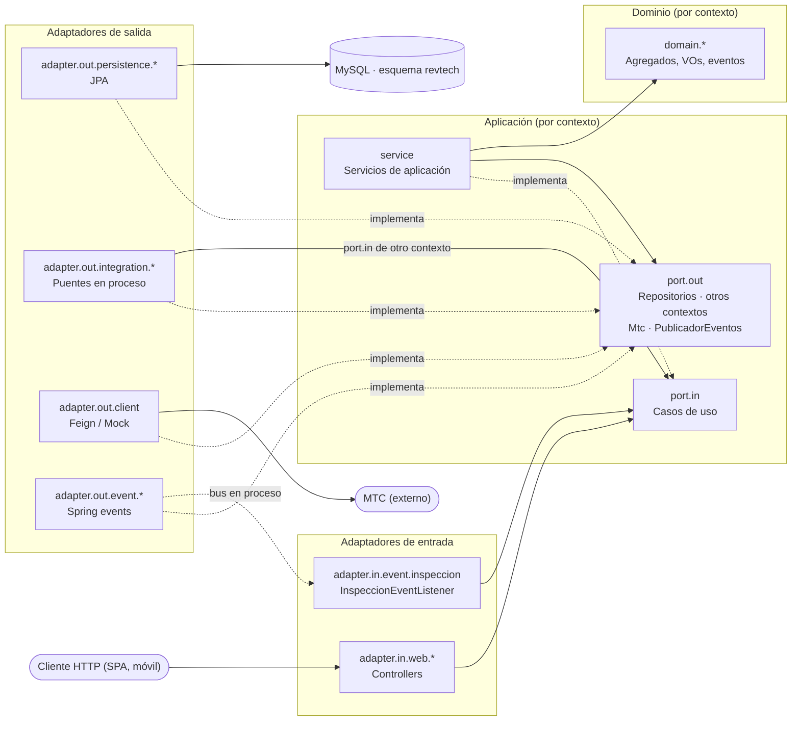
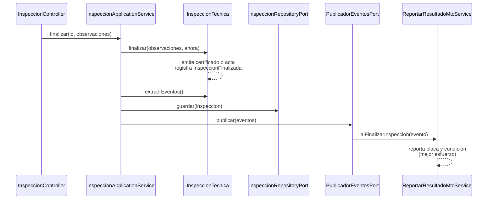

# Arquitectura Hexagonal — `revtech-app`

`revtech-app` es un **monolito modular hexagonal**: un único desplegable que aloja los contextos acotados definidos en
[DISEÑO TÁCTICO - REVTECH](DISEÑO%20TÁCTICO%20-%20REVTECH.md), siguiendo el patrón *Ports & Adapters*.

| Contexto | Subpaquete | Responsabilidad |
|---|---|---|
| Inspección (core) | `inspeccion` | Ciclo de vida de la inspección técnica, pruebas y emisión de certificado o acta |
| Atención a Clientes | `clientes` | Clientes y parque vehicular |
| Identidad y Acceso | `identidad` | Usuarios, roles, permisos y autenticación |

## Distribución de paquetes (híbrida)

La **capa** es el paquete de primer nivel y el **contexto** es un subpaquete de cada capa:

```
org.parangaricutirimicuaro.revtech
 ├─ domain/        inspeccion · clientes · identidad
 ├─ application/   inspeccion · clientes · identidad      (port/in · port/out · service)
 ├─ adapter/
 │   ├─ in/web/          inspeccion · clientes · identidad · shared
 │   ├─ in/event/        inspeccion
 │   ├─ out/persistence/ inspeccion · clientes · identidad
 │   ├─ out/event/       inspeccion
 │   ├─ out/integration/ inspeccion     ← puentes en proceso hacia otros contextos
 │   └─ out/client/      MTC (Feign / Mock)
 └─ config/        inspeccion · clientes · identidad  + Scalar, CORS, Feign
```

## Capas y regla de dependencias



| Capa | Paquete | Depende de |
|---|---|---|
| Dominio | `domain.<contexto>` | Nada (Java puro) |
| Aplicación | `application.<contexto>` | Dominio del mismo contexto |
| Adaptadores de entrada | `adapter.in.*` | Puertos de entrada, dominio |
| Adaptadores de salida | `adapter.out.*` | Puertos de salida, dominio |
| Composición | `config` | Todo (ensambla los beans) |

### Comunicación entre contextos

Un contexto **nunca** importa el dominio ni la aplicación de otro contexto. Cuando Inspección necesita un vehículo o un
usuario, define su propio puerto de salida (`VehiculoPort`, `UsuarioPort`) con la vista mínima que necesita
(`VehiculoInfo`, `UsuarioInfo`). Un adaptador en `adapter.out.integration.inspeccion` implementa ese puerto llamando al
**puerto de entrada** del contexto dueño del dato (`ConsultarVehiculoUseCase`, `ConsultarUsuarioUseCase`) y traduce el resultado.

Así, extraer un contexto a un servicio independiente en el futuro solo requiere reemplazar ese adaptador.

### Verificación automática

`architecture/HexagonalArchitectureTest` (ArchUnit) comprueba:

- La regla de capas (adaptadores → aplicación → dominio) y que dominio y aplicación no dependan de frameworks.
- Que los adaptadores de entrada no dependan de los de salida.
- Que el núcleo y los adaptadores de cada contexto no importen el `domain`/`application` de otro contexto.
- Que `adapter.out.integration` use solo puertos de entrada y nunca servicios de otro contexto.

Al agregar un contexto nuevo basta con añadir su nombre a `CONTEXTOS` en esa prueba.

## Modelo de dominio — Inspección

| Patrón DDD | Implementación |
|---|---|
| Raíz de agregado | `InspeccionTecnica`: sin setters; el estado solo cambia mediante `iniciar`, `registrarPrueba` y `finalizar`. |
| Entidades internas | `CertificadoInspeccion`, `ActaObservaciones`: solo la raíz puede emitirlas (factorías de paquete). |
| Objetos de valor | `PeriodoInspeccion`, `ResultadoInspeccion`, `ResultadoPrueba` (records inmutables, validados al construirse). |
| Catálogos del lenguaje ubicuo | `TipoPrueba` (frenos, dirección, suspensión, luces, neumáticos, emisiones), `VeredictoPrueba`, `TipoInspeccion`, `EstadoProceso`. |
| Identificadores tipados | `InspeccionId`, `VehiculoId`, `PersonalId`: impiden confundir referencias entre conceptos y contextos. |
| Factorías con intención | `InspeccionTecnica.registrar(...)` y `InspeccionTecnica.reinspeccionar(origen, ...)`. |
| Eventos de dominio | `InspeccionFinalizada`, registrado por la raíz y publicado por la aplicación tras persistir. |
| Reconstitución protegida | `InspeccionTecnica.Snapshot` valida la coherencia con el ciclo de vida; una fila inconsistente no se reconstituye. |

**Ciclo de vida:** `REGISTRADA → EN_PROCESO → FINALIZADA`. Cualquier otra transición lanza
`TransicionEstadoInvalidaException`.

**Reglas de negocio:**

- Solo se reinspecciona una inspección **FINALIZADA con resultado OBSERVADO**, y siempre **al mismo vehículo**.
- Cada tipo de prueba se registra **una sola vez** por inspección.
- No se finaliza sin pruebas, y al finalizar se emite exactamente un documento.
- Una prueba `OBSERVADO` o `RECHAZADO` produce un acta. Si todas están `APROBADO`, se emite un certificado.
- El vehículo debe existir en Atención a Clientes, y el inspector (y el supervisor, si se indica) deben existir y estar activos en Identidad.

## Modelo de dominio — Clientes e Identidad

| Contexto | Agregados | Identificadores | Reglas |
|---|---|---|---|
| Clientes | `Cliente`, `Vehiculo` (referencia a su propietario por `ClienteId`) | `ClienteId`, `VehiculoId` | Documento y nombre obligatorios; placa obligatoria y normalizada a mayúsculas; `transferirPropietario`. |
| Identidad | `Usuario` (referencia su rol por `RolId`), `RolAcceso` | `UsuarioId`, `RolId` | Username único; solo se asignan roles existentes y activos; suspensión de usuarios; token de sesión simulado. |

Ambos modelos usan factorías (`registrar`) para objetos nuevos y `reconstituir` para objetos persistidos.

## Eventos de dominio



Los eventos se publican solo después de persistir: si el guardado falla, no se publica nada. El reporte al MTC es de mejor esfuerzo, así que un fallo externo no revierte la inspección.

## Casos de uso

| Contexto | Puerto de entrada | Endpoint |
|---|---|---|
| Inspección | `CrearInspeccionUseCase` | `POST /api/inspecciones` |
| Inspección | `IniciarInspeccionUseCase` | `PUT /api/inspecciones/{id}/iniciar` |
| Inspección | `RegistrarPruebaUseCase` | `POST /api/inspecciones/{id}/pruebas` |
| Inspección | `FinalizarInspeccionUseCase` | `PUT /api/inspecciones/{id}/finalizar` |
| Inspección | `ConsultarInspeccionUseCase` | `GET /api/inspecciones/{id}` |
| Inspección | `ReportarResultadoMtcUseCase` | Evento `InspeccionFinalizada` |
| Clientes | `ConsultarClienteUseCase` | `GET /api/clientes/{id}`, `GET /api/clientes/doc/{docIdent}` |
| Clientes | `CrearVehiculoUseCase` | `POST /api/vehiculos` |
| Clientes | `ConsultarVehiculoUseCase` | `GET /api/vehiculos/{id}`, `GET /api/vehiculos/placa/{placa}` · usado por Inspección |
| Identidad | `RegistrarUsuarioUseCase` | `POST /api/usuarios` |
| Identidad | `ConsultarUsuarioUseCase` | `GET /api/usuarios/{id}` · usado por Inspección |
| Identidad | `GestionarUsuarioUseCase`, `AutenticarUseCase` | Sin endpoint todavía |

## Errores HTTP (Problem Details, RFC 9457)

| Excepción | HTTP |
|---|---|
| `DatoInvalidoException`, `DatoClienteInvalidoException`, `DatoIdentidadInvalidoException`, validación de request | 400 |
| `CredencialesInvalidasException` | 401 |
| `InspeccionNoEncontradaException`, `RecursoIdentidadNoEncontradoException` | 404 |
| `TransicionEstadoInvalidaException`, `ReglaNegocioVioladaException`, `ReglaIdentidadVioladaException` | 409 |
| `ReferenciaExternaInvalidaException` (vehículo/usuario inexistente o inactivo) | 422 |
| `ServicioExternoNoDisponibleException` | 503 |

Las consultas `GET` de clientes, vehículos y usuarios responden 404 sin cuerpo cuando el recurso no existe.

## Persistencia

- Un único esquema `revtech`; cada contexto es dueño de sus tablas:
  - Inspección: `inspecciones_tecnicas`, `inspeccion_pruebas`, `certificados_inspeccion`, `actas_observaciones`.
  - Clientes: `clientes`, `vehiculos`.
  - Identidad: `usuarios`, `roles_acceso`, `rol_permisos`.
- Las tablas de un contexto solo se leen a través de sus adaptadores de persistencia; otro contexto nunca las consulta directamente.
- El esquema lo genera Hibernate (`ddl-auto=update`). La incorporación de migraciones versionadas (Flyway) está pendiente.
- Una base con datos anteriores se limpia con `mise run db:recreate` (borra el volumen del contenedor).

## Pruebas

| Suite | Alcance | Requiere MySQL |
|---|---|---|
| `domain.*.*Test` | Reglas de los agregados y objetos de valor | No |
| `application.*.service.*Test` | Casos de uso con puertos simulados (Mockito o en memoria) y reloj fijo | No |
| `adapter.in.web.*Test` | `@WebMvcTest`: contrato JSON, validación y mapeo de errores | No |
| `adapter.out.integration.*Test`, `adapter.out.client.*Test`, `*MapperTest` | Traducciones de adaptadores | No |
| `adapter.*.event.*Test` | Publicación y enrutamiento de eventos en Spring | No |
| `architecture.HexagonalArchitectureTest` | Regla de dependencias y aislamiento entre contextos | No |
| `InspeccionPersistenceAdapterTest`, `RevTechApplicationTests` | JPA contra MySQL real (rollback) | Sí |

```powershell
# Solo pruebas sin infraestructura
./mvnw test -pl revtech-app "-Dtest=!InspeccionPersistenceAdapterTest,!RevTechApplicationTests" "-Dsurefire.failIfNoSpecifiedTests=false"

# Suite completa
mise run db:up
./mvnw test -pl revtech-app
```
